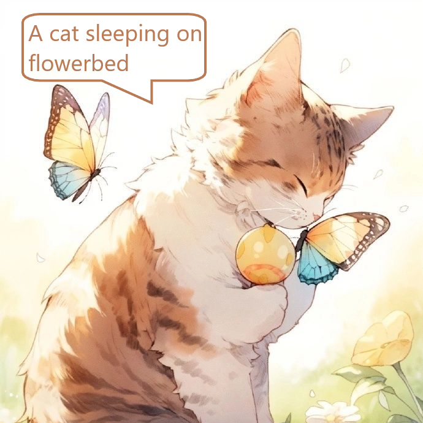
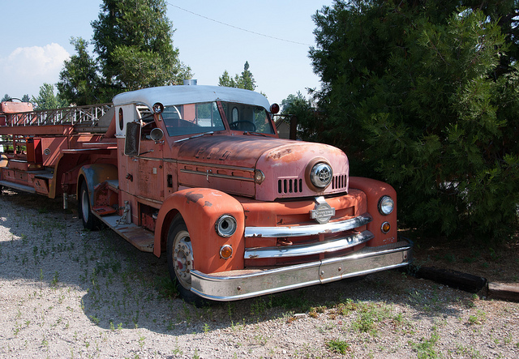

<div align="center">



# Pytorch Image Captioning


</div> 

## Contents
* [About](#about)
* [Packages](#packages)
* [References](#references)
* [Specifications](#specifications)
* [Installation](#installation)
* [Usages](#usages)
* [Notes](#notes)

<a name="about"></a>

## About
PyTorch Image Captioning - Automatic image description generation using deep learning.  
- Developed and trained a PyTorch image captioning model utilizing Inceptionv3 as a CNN backbone and a LSTM network for sequence generation.
- Improved data loading speed by 70% through hyperparameter optimization and GPU utilized preprocessing.
- Achieved a METEOR Score of 0.245 and a BLEU Score of 0.022 on a test set of 1000 random images.
<a name="packages"></a>

## Packages
- PyTorch.
- Natural Language Toolkit (NLTK).
- Numpy.
- Matplotlib.

<a name="references"></a>

## References
- Common Objects in Context Dataset by [Microsoft](https://cocodataset.org). 

<a name="specifications"></a>

## Specifications
### <ins>Model</ins>
- The encoder-decoder framework used is illustrated below.
- The encoder is a pretrained Convolutional Neural Network known as InceptionV3, also called as GoogleNetV3, trained on Imagenet.
- The decoder is a Long Short-term Memory Network with 1 recurrent layer taking the output of the encoder as input.  
<div align="center">

</div>

### <ins>Train</ins>
- The model is trained on the annotated MS COCO 2014 dataset of over 80000 training images and over 40000 validation images.
- All layers except the last layer of the InceptionV3 is frozen. The last layer is replaced by a Linear layer which transforms the feature vector to have the required input dimensions for LSTM.
- To extract word embedding from image's feature vectors, an Embedding layer is used and its output becomes LSTM's input.
- Reference captions from MS COCO is tokenized, padded and used to create a Vocabulary object. As the LSTM processes the features, it generates a probability distribution over the words in the vocabulary for the next word in the sequence.
- Based on the context learned from the previous steps, to choose the next word, the model selects the word with the highest probability from the vocabulary. Repeat until a sequence of chosen length is formed.

### <ins>Test</ins>
- Model is tested on 1000 randomly sampled images from MS COCO's Test Dataset.
- The result is then evaluated by using METEOR and BLEU score which the higher score, the better the quality of the caption.

<a name="installation"></a>

## Installation
```
python3 -m venv env
source env/Scripts/activate
pip install -r requirements.txt
```  

<a name="usages"></a>

## Usages
- Download model.pth from [Releases](https://github.com/haicanberra/PyTorch-Image-Captioning/releases/tag/v1.0.0) and clone the repository.
- Place model.pth into ```models``` folder.
- Place images that need to be captioned into ```evaluate``` folder.
- Run ```evaluate.py```, the output captions will be written in ```output\output.txt```.

<a name="notes"></a>

## Notes
- <ins>Add</ins>: Attention mechanism, according to [Article](https://arxiv.org/abs/1502.03044)
- Due to the lack of Attention mechanism, the model could not capture the focus of the image, which the reference captions describe.
- This resulted in the low METEOR and BLEU score as the hypothesis has no alignment to the reference.
- Examples:
<div>




</div>

"COCO_val2014_000000483108.jpg": [
        "A man on a bicycle riding next to a train",
        "a train traveling down tracks next to a lush green field ."
    ],
    METEOR: 0.4373 / BLEU: 3.9876353728947065e-78
"COCO_val2014_000000337264.jpg": [
        "a couple of women  are in a kitchen",
        "a kitchen with a stove "
    ],
    METEOR: 0.1948 / BLEU: 5.094696780347207e-155
"COCO_val2014_000000542145.jpg": [
        "A toilet and a sink in small bathroom.",
        "a bathroom with a toilet and a sink"
    ],
    METEOR: 0.6617 / BLEU: 0.47750342648354643
"COCO_val2014_000000235006.jpg": [
        "An orange truck driving next to a forest.",
        "a truck parked on the side of the road ."
    ],
    METEOR: 0.1648 / BLEU: 1.3483065280626046e-231
"COCO_val2014_000000026942.jpg": [
        "A gray tiger cat sitting at a wooden table on a chair.",
        "a cat laying on top of a wooden table ."
    ],
    METEOR: 0.3776 / BLEU: 3.378676787545745e-78

 FOLDER STRUCTURE
 C:.
 ├───debug
 │   ├───train
 │   │   ├───annotations
 │   │   └───train2014
 │   └───val
 │       ├───annotations
 │       └───val2014
 ├───nobug
 │   ├───train
 │   │   ├───annotations.json
 │   │   └───train2014
 │   └───val
 │       ├───annotations.json
 │       └───val2014

 Epoch [1/10] - Train Loss: 3.0864389271730617 - Validation Loss: 2.6335544072056267
Epoch [2/10] - Train Loss: 2.447707887224862 - Validation Loss: 2.4546404053437954
Epoch [3/10] - Train Loss: 2.2442663139388235 - Validation Loss: 2.401020363232159
Epoch [4/10] - Train Loss: 2.114552161248439 - Validation Loss: 2.3909789499889995
Epoch [5/10] - Train Loss: 2.0163803068329846 - Validation Loss: 2.3994741667691755
Epoch [6/10] - Train Loss: 1.9356619593347875 - Validation Loss: 2.4147298296480946
Epoch [7/10] - Train Loss: 1.8686698923988327 - Validation Loss: 2.434351029365925
Epoch [8/10] - Train Loss: 1.8108929144538966 - Validation Loss: 2.455642291814042
Epoch [9/10] - Train Loss: 1.7593759432417755 - Validation Loss: 2.483545883948581
Epoch [10/10] - Train Loss: 1.7146276916644727 - Validation Loss: 2.5100175576375747

